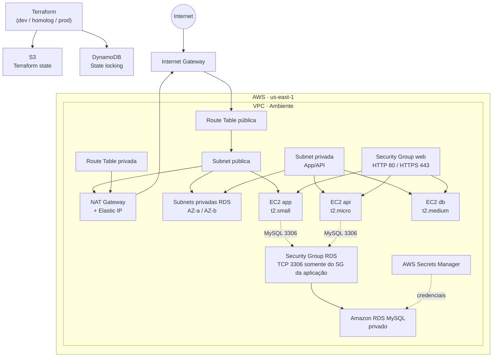

# 🚀 Terraform AWS Infrastructure with Modules

Este projeto provisiona uma infraestrutura AWS com **Terraform** e princípios de **Infrastructure as Code (IaC)**. A arquitetura é organizada em módulos reutilizáveis, separando rede, conectividade, segurança, computação, banco de dados, segredos e state remoto.

Os ambientes disponíveis são `dev`, `homolog` e `prod`. Cada ambiente possui sua própria VPC, CIDRs isolados e seu próprio state Terraform no backend S3.

## 🏗️ Arquitetura



### Comunicação entre os recursos

| Origem | Destino | Fluxo | Estado |
|---|---|---|---|
| Internet | EC2 `app` | Internet Gateway → rota pública → HTTP/HTTPS | Configurado |
| EC2 privadas | Internet | Rota privada → NAT Gateway → Internet Gateway | Configurado |
| Terraform | S3 | Leitura e gravação do state | Configurado |
| Terraform | DynamoDB | Lock do state | Configurado |
| Terraform | Secrets Manager | Criação/gerenciamento do segredo do banco | Configurado |
| EC2 aplicação/API | RDS | TCP/3306 através do Security Group da aplicação | Configurado |
| Internet | RDS | TCP/3306 | **Bloqueado** |
| Internet | EC2 `api` | Acesso direto | **Bloqueado pela subnet privada** |

> A EC2 chamada `db` é uma instância computacional do projeto; ela não é o Amazon RDS. O RDS é um recurso de banco de dados separado.

## 🌐 Segmentação de rede

Cada ambiente possui uma VPC independente e CIDRs que não se sobrepõem.

| Ambiente | VPC | Subnet pública | Subnet privada App/API | RDS A | RDS B |
|---|---|---|---|---|---|
| `dev` | `10.10.0.0/16` | `10.10.1.0/24` | `10.10.10.0/24` | `10.10.20.0/24` | `10.10.21.0/24` |
| `homolog` | `10.20.0.0/16` | `10.20.1.0/24` | `10.20.10.0/24` | `10.20.20.0/24` | `10.20.21.0/24` |
| `prod` | `10.30.0.0/16` | `10.30.1.0/24` | `10.30.10.0/24` | `10.30.20.0/24` | `10.30.21.0/24` |

Essa separação permite que cada ambiente tenha uma rede independente, evitando sobreposição de endereços IP.

### Subnets do RDS

O RDS utiliza duas subnets privadas em **Availability Zones diferentes**.

```text
RDS Subnet Group
├── RDS Subnet A → us-east-1a
│   └── 10.x0.20.0/24
│
└── RDS Subnet B → us-east-1b
    └── 10.x0.21.0/24
```

As subnets do banco não são destinadas às EC2 da aplicação. Elas existem especificamente para fornecer a rede necessária ao RDS.

## 🔐 Security Groups

A infraestrutura utiliza Security Groups separados por função.

### Security Group da aplicação

O Security Group `web` controla o acesso às instâncias EC2.

```text
Internet
   │
   ├── TCP/80
   └── TCP/443
         │
         ▼
   Security Group Web
         │
         ▼
      EC2 App
```

### Security Group do RDS

O RDS possui um Security Group exclusivo.

A regra de entrada permite somente:

```text
Security Group da aplicação
          │
          │ TCP/3306
          ▼
   Security Group RDS
          │
          ▼
     Amazon RDS
```

Não existe uma regra:

```text
0.0.0.0/0 → TCP/3306
```

Portanto, o banco não fica diretamente exposto à Internet.

## 🛠️ Tecnologias utilizadas

| Tecnologia | Utilização |
|---|---|
| Terraform | Infrastructure as Code e modularização |
| AWS | Cloud provider |
| VPC e Subnets | Rede isolada e segmentação |
| EC2 | Instâncias `app`, `api` e `db` |
| Internet Gateway | Conectividade pública |
| NAT Gateway + EIP | Saída de internet das subnets privadas |
| Security Groups | Controle de tráfego |
| S3 + DynamoDB | State remoto e lock do Terraform |
| AWS Secrets Manager | Armazenamento de credenciais do RDS |
| Amazon RDS MySQL | Banco de dados relacional privado |
| Ubuntu | Sistema operacional das EC2 |

## 📦 Recursos e módulos

| Módulo/local | Recursos principais |
|---|---|
| `bootstrap/` | Bucket S3, DynamoDB, versionamento e bloqueio público |
| `modules/vpc/` | VPC, subnet pública, subnet privada e subnets exclusivas do RDS |
| `modules/igw/` | Internet Gateway, rota pública e associação |
| `modules/nat_gateway/` | Elastic IP, NAT Gateway, rota privada e associação |
| `modules/security-group/` | Security Group web e Security Group exclusivo do RDS |
| `modules/ec2/` | Instâncias EC2 criadas com `for_each` |
| `modules/secrets_manager/` | Segredos de credenciais por ambiente |
| `modules/rds/` | DB Subnet Group e instância RDS MySQL privada |

## 🗄️ Amazon RDS

O projeto utiliza Amazon RDS MySQL como banco de dados gerenciado.

O RDS é executado em subnets privadas e utiliza um `aws_db_subnet_group` contendo duas subnets em Availability Zones diferentes.

```text
VPC
│
├── Public Subnet
│
├── Private App Subnet
│
├── Private RDS Subnet A
│      └── us-east-1a
│
└── Private RDS Subnet B
       └── us-east-1b
```

O módulo RDS recebe os IDs das subnets e o Security Group específico do banco:

```hcl
module "rds" {
  source = "../../modules/rds"

  # demais argumentos...

  rds_subnet_ids        = module.vpc.rds_subnet_ids
  rds_security_group_id = module.security_group.rds_security_group_id
}
```

O `aws_db_instance` utiliza:

```hcl
db_subnet_group_name   = aws_db_subnet_group.this.name
vpc_security_group_ids = [var.rds_security_group_id]
```

## 🖥️ Instâncias EC2

As instâncias são criadas dinamicamente com `for_each`:

```hcl
locals {
  servers = {
    app = "t2.small"
    api = "t2.micro"
    db  = "t2.medium"
  }
}
```

| Instância | Tipo | Rede |
|---|---|---|
| `app` | `t2.small` | Subnet pública |
| `api` | `t2.micro` | Subnet privada |
| `db` | `t2.medium` | Subnet privada |

> A EC2 `db` não substitui o RDS. Ela representa uma instância computacional independente dentro da arquitetura.

## 🔎 Busca dinâmica da AMI

A AMI do Ubuntu é obtida por um `data source`, sem depender de um ID fixo:

```hcl
data "aws_ami" "ubuntu" {
  most_recent = true
  owners      = ["099720109477"]

  filter {
    name   = "name"
    values = ["ubuntu/images/hvm-ssd-gp3/ubuntu-noble-24.04-amd64-server-*"]
  }
}
```

## 📂 Estrutura do projeto

```text
.
├── bootstrap/                 # Backend remoto: S3 e DynamoDB
├── enviroments/
│   ├── dev/
│   ├── homolog/
│   └── prod/
├── modules/
│   ├── ec2/
│   ├── igw/
│   ├── nat_gateway/
│   ├── rds/
│   ├── secrets_manager/
│   ├── security-group/
│   └── vpc/
├── main.tf                    # Configuração raiz de laboratório
├── terraform.tf
└── README.md
```

## 🧠 Conceitos Terraform utilizados

- Infrastructure as Code
- Terraform Modules
- Variables e Outputs
- Locals e `for_each`
- Data Sources
- Backends remotos
- Dependências entre módulos
- Recursos AWS
- VPC e subnetting
- Route Tables
- Internet Gateway
- NAT Gateway
- Elastic IP
- Security Groups
- DB Subnet Groups
- Amazon RDS
- AWS Secrets Manager
- Separação de ambientes

## 🚀 Como executar

### 1. Criar o backend remoto

```powershell
cd bootstrap
terraform init
terraform fmt -check
terraform validate
terraform plan
terraform apply
```

### 2. Inicializar um ambiente

Após criar o backend, inicialize o ambiente desejado:

```powershell
cd enviroments\dev
terraform init -reconfigure
terraform fmt -check
terraform validate
terraform plan
```

Repita o processo para `homolog` e `prod`.

Execute:

```powershell
terraform apply
```

somente depois de revisar o plano de execução.

## 🔐 Segurança e custos

- Os arquivos `*.tfvars`, `.terraform/` e `*.tfstate*` são ignorados pelo Git.
- As variáveis de usuário e senha do banco foram declaradas como sensíveis.
- Não versione senhas.
- Prefira variáveis de ambiente como `TF_VAR_db_username` e `TF_VAR_db_password`.
- O bucket de state possui versionamento, bloqueio de acesso público e `prevent_destroy`.
- O Security Group do RDS não permite acesso de `0.0.0.0/0` na porta `3306`.
- O acesso ao RDS é permitido somente pelo Security Group autorizado da aplicação.
- As subnets do RDS são privadas e distribuídas em Availability Zones diferentes.
- Os ambientes `dev`, `homolog` e `prod` utilizam CIDRs distintos e sem sobreposição.
- O SG web atualmente permite HTTP/HTTPS de `0.0.0.0/0`; em produção, restrinja os CIDRs ou utilize um Application Load Balancer.
- NAT Gateway e Elastic IP geram custos enquanto estiverem ativos.
- Amazon RDS gera custos enquanto a instância estiver provisionada.

## 📌 Status da infraestrutura

### Rede

- [x] VPC
- [x] Subnet pública
- [x] Subnet privada para aplicação/API
- [x] Duas subnets privadas exclusivas para RDS
- [x] Availability Zones diferentes para as subnets do RDS
- [x] Internet Gateway
- [x] NAT Gateway
- [x] Elastic IP
- [x] Route Tables
- [x] CIDRs separados por ambiente

### Segurança

- [x] Security Group da aplicação
- [x] Security Group exclusivo do RDS
- [x] Acesso MySQL TCP/3306 restrito ao Security Group da aplicação
- [x] RDS sem acesso direto da Internet
- [x] Secrets Manager para credenciais

### RDS

- [x] Amazon RDS MySQL
- [x] DB Subnet Group
- [x] Subnets privadas em AZs diferentes
- [x] Security Group exclusivo
- [x] Associação do RDS ao DB Subnet Group
- [x] Associação do RDS ao Security Group

### Ambientes

- [x] `dev`
- [x] `homolog`
- [x] `prod`
- [x] CIDRs independentes
- [x] State separado por ambiente

```
