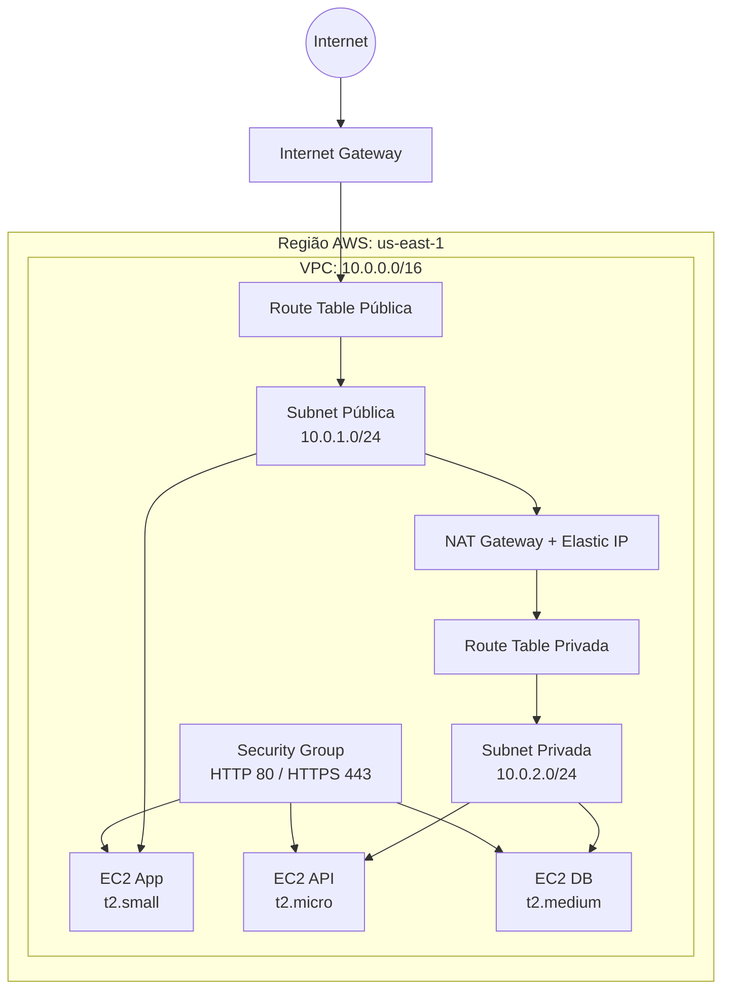

# 🚀 Terraform AWS Infrastructure with Modules

Este projeto provisiona uma infraestrutura AWS utilizando **Terraform como ferramenta de Infrastructure as Code (IaC)**.

A arquitetura foi desenvolvida utilizando módulos Terraform reutilizáveis, separando responsabilidades como rede, segurança e computação.

O objetivo do projeto é criar uma base de infraestrutura AWS seguindo boas práticas de organização, modularização e automação.

---

# 🏗️ Arquitetura



---

# 🛠️ Tecnologias utilizadas

| Tecnologia       | Utilização                         |
| ---------------- | ---------------------------------- |
| Terraform        | Infrastructure as Code             |
| AWS              | Cloud Provider                     |
| EC2              | Instâncias computacionais          |
| VPC              | Rede isolada                       |
| Subnets          | Segmentação de rede                |
| Internet Gateway | Acesso público                     |
| NAT Gateway      | Saída de internet privada          |
| Security Groups  | Controle de tráfego                |
| Ubuntu           | Sistema operacional das instâncias |

---

# 📦 Recursos provisionados

| Módulo           | Recursos                                           |
| ---------------- | -------------------------------------------------- |
| `vpc`            | VPC, subnet pública e subnet privada               |
| `igw`            | Internet Gateway, Route Table pública e associação |
| `nat_gateway`    | Elastic IP, NAT Gateway, Route Table privada       |
| `security-group` | Regras HTTP (80) e HTTPS (443)                     |
| `ec2`            | Instâncias EC2 app, api e db                       |

---

# 🖥️ Instâncias EC2

As instâncias são criadas dinamicamente utilizando `for_each` baseado em um mapa definido no Terraform:

```hcl
locals {
  servers = {
    app = "t2.small"
    api = "t2.micro"
    db  = "t2.medium"
  }
}
```

Distribuição:

| Instância | Tipo      | Rede           |
| --------- | --------- | -------------- |
| app       | t2.small  | Subnet pública |
| api       | t2.micro  | Subnet privada |
| db        | t2.medium | Subnet privada |

---

# 🔎 Busca dinâmica da AMI

A AMI não fica fixa no código.

O Terraform consulta automaticamente a imagem mais recente do Ubuntu através de um Data Source:

```hcl
data "aws_ami" "ubuntu" {

  most_recent = true

  owners = [
    "099720109477"
  ]

}
```

Isso evita manutenção manual sempre que uma nova versão da imagem é disponibilizada.

---

# 📂 Estrutura do projeto

```text
.
├── main.tf
├── terraform.tf
├── modules/
│
├── vpc/
│   ├── main.tf
│   ├── variables.tf
│   └── outputs.tf
│
├── igw/
│
├── nat_gateway/
│
├── security-group/
│
└── ec2/
    
└── README.md
```

---

# 🧠 Conceitos Terraform utilizados

Este projeto aplica:

✅ Infrastructure as Code
✅ Terraform Modules
✅ Variables
✅ Outputs
✅ Locals
✅ For Each
✅ Data Sources
✅ Recursos AWS com dependências entre módulos

---

# 🚀 Como executar

Inicializar Terraform:

```bash
terraform init
```

Formatar arquivos:

```bash
terraform fmt -recursive
```

Validar configuração:

```bash
terraform validate
```

Visualizar alterações:

```bash
terraform plan
```

Criar infraestrutura:

```bash
terraform apply
```

Remover infraestrutura:

```bash
terraform destroy
```

---

# 🔐 Segurança e custos

* O Security Group atualmente permite HTTP e HTTPS através de `0.0.0.0/0`.
* Em ambientes produtivos, recomenda-se restringir os CIDRs permitidos.
* NAT Gateway e Elastic IP possuem custos associados.
* Utilize `terraform destroy` após testes em ambientes de laboratório.

---

# 📌 Próximas evoluções

* [ ] Remote State utilizando S3 + DynamoDB
* [ ] Load Balancer (ALB)
* [ ] Auto Scaling Group
* [ ] IAM Roles
* [ ] RDS PostgreSQL
* [ ] ECR para containers Docker
* [ ] EKS Kubernetes
* [ ] Pipeline CI/CD com GitHub Actions

```
```
