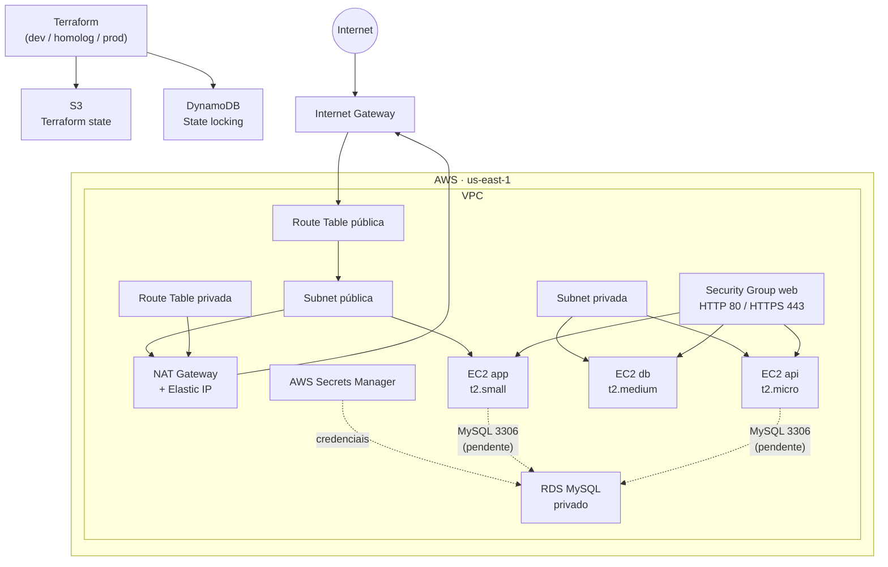

# 🚀 Terraform AWS Infrastructure with Modules

Este projeto provisiona uma infraestrutura AWS com **Terraform** e princípios de **Infrastructure as Code (IaC)**. A arquitetura é organizada em módulos reutilizáveis, separando rede, conectividade, segurança, computação, banco de dados, segredos e state remoto.

Os ambientes disponíveis são `dev`, `homolog` e `prod`; cada um possui seu próprio state Terraform no mesmo backend S3.

## 🏗️ Arquitetura



### Comunicação entre os recursos

| Origem | Destino | Fluxo | Estado |
|---|---|---|---|
| Internet | EC2 `app` | Internet Gateway → rota pública → HTTP/HTTPS | Configurado no SG web |
| EC2 privadas | Internet | rota privada → NAT Gateway → Internet Gateway | Configurado |
| Terraform | S3 | Leitura e gravação de state | Configurado |
| Terraform | DynamoDB | Lock do state | Configurado |
| Terraform | Secrets Manager | Criação do segredo com credenciais do banco | Configurado |
| Aplicação/API | RDS | MySQL por TCP/3306 | Pendente: DB subnet group e SG próprio |

> A EC2 chamada `db` é uma instância computacional do projeto; ela não é o Amazon RDS. O RDS é um recurso de banco separado.

## 🛠️ Tecnologias utilizadas

| Tecnologia | Utilização |
|---|---|
| Terraform | Infrastructure as Code e modularização |
| AWS | Cloud provider |
| VPC e Subnets | Rede isolada e segmentação |
| EC2 | Instâncias `app`, `api` e `db` |
| Internet Gateway | Conectividade pública |
| NAT Gateway + EIP | Saída de internet das subnets privadas |
| Security Groups | Controle de tráfego |
| S3 + DynamoDB | State remoto e lock do Terraform |
| AWS Secrets Manager | Armazenamento de credenciais do RDS |
| Amazon RDS MySQL | Banco de dados relacional privado |
| Ubuntu | Sistema operacional das EC2 |

## 📦 Recursos e módulos

| Módulo/local | Recursos principais |
|---|---|
| `bootstrap/` | Bucket S3, DynamoDB, versionamento e bloqueio público |
| `modules/vpc/` | VPC, subnet pública e subnet privada |
| `modules/igw/` | Internet Gateway, rota pública e associação |
| `modules/nat_gateway/` | Elastic IP, NAT Gateway, rota privada e associação |
| `modules/security-group/` | Security Group web para HTTP/HTTPS |
| `modules/ec2/` | Instâncias EC2 criadas com `for_each` |
| `modules/secrets_manager/` | Segredos de credenciais por ambiente |
| `modules/rds/` | Instância RDS MySQL privada |

### State remoto por ambiente

| Ambiente | Chave S3 |
|---|---|
| dev | `dev/terraform.tfstate` |
| homolog | `homologacao/terraform.tfstate` |
| prod | `prod/terraform.tfstate` |

## 🖥️ Instâncias EC2

As instâncias são criadas dinamicamente com `for_each`:

```hcl
locals {
  servers = {
    app = "t2.small"
    api = "t2.micro"
    db  = "t2.medium"
  }
}
```

| Instância | Tipo | Rede |
|---|---|---|
| app | `t2.small` | Subnet pública |
| api | `t2.micro` | Subnet privada |
| db | `t2.medium` | Subnet privada |

## 🔎 Busca dinâmica da AMI

A AMI do Ubuntu é obtida por um `data source`, sem depender de um ID fixo:

```hcl
data "aws_ami" "ubuntu" {
  most_recent = true
  owners      = ["099720109477"]

  filter {
    name   = "name"
    values = ["ubuntu/images/hvm-ssd-gp3/ubuntu-noble-24.04-amd64-server-*"]
  }
}
```

## 📂 Estrutura do projeto

```text
.
├── bootstrap/                 # Backend remoto: S3 e DynamoDB
├── enviroments/
│   ├── dev/
│   ├── homolog/
│   └── prod/
├── modules/
│   ├── ec2/
│   ├── igw/
│   ├── nat_gateway/
│   ├── rds/
│   ├── secrets_manager/
│   ├── security-group/
│   └── vpc/
├── main.tf                    # Configuração raiz de laboratório
├── terraform.tf
└── README.md
```

## 🧠 Conceitos Terraform utilizados

- Infrastructure as Code
- Terraform Modules
- Variables e Outputs
- Locals e `for_each`
- Data Sources
- Backends remotos
- Dependências entre módulos
- Recursos AWS e Security Groups

## 🚀 Como executar

### 1. Criar o backend remoto

```powershell
cd bootstrap
terraform init
terraform fmt -check
terraform validate
terraform plan
terraform apply
```

### 2. Inicializar um ambiente

Após criar o backend, inicialize o ambiente desejado:

```powershell
cd enviroments\dev
terraform init -reconfigure
terraform fmt -check
terraform validate
terraform plan
```

Repita o processo para `homolog` e `prod`. Execute `terraform apply` apenas depois de revisar o plano.

## 🔐 Segurança e custos

- Os arquivos `*.tfvars`, `.terraform/` e `*.tfstate*` são ignorados pelo Git.
- As variáveis de usuário e senha do banco foram declaradas como sensíveis.
- Não versione senhas; prefira variáveis de ambiente `TF_VAR_db_username` e `TF_VAR_db_password`.
- O bucket de state possui versionamento, bloqueio de acesso público e `prevent_destroy`.
- O SG web atualmente permite HTTP/HTTPS de `0.0.0.0/0`; em produção, restrinja os CIDRs ou use um Load Balancer.
- NAT Gateway e Elastic IP geram custos enquanto ativos.

## 📌 Pendências e próximas evoluções

### Necessárias para concluir o RDS

- [ ] Criar duas subnets privadas em AZs diferentes.
- [ ] Criar e associar um `aws_db_subnet_group` ao RDS.
- [ ] Criar um Security Group exclusivo para o RDS.
- [ ] Liberar TCP/3306 no SG do RDS somente para o SG da aplicação.
- [ ] Definir CIDRs e nomes distintos para dev, homolog e prod.
- [ ] Confirmar uma versão MySQL disponível para RDS em `us-east-1`.
- [ ] Adicionar criptografia padrão ao bucket S3 do backend.

### Evoluções futuras

- [ ] Application Load Balancer (ALB)
- [ ] Auto Scaling Group
- [ ] IAM Roles para EC2 e Terraform
- [ ] ECR e containers Docker
- [ ] EKS Kubernetes
- [ ] Pipeline CI/CD com GitHub Actions
